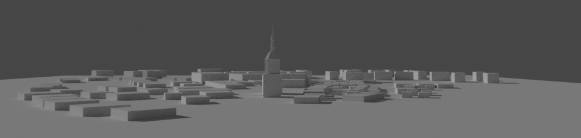
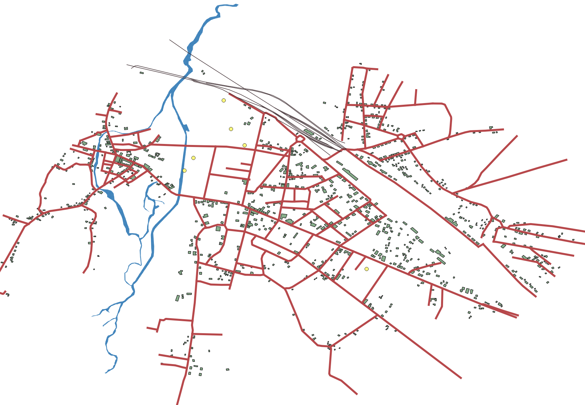

# Kowel: A Glimpse into the Past
[Polish Wikipedia: Kowel](https://pl.wikipedia.org/wiki/Kowel) / [English Wikipedia: Kovel](https://en.wikipedia.org/wiki/Kovel) (1918-1945)

This passion project, developed by @skilenstein, aims to recreate the historic town of Kowel as it existed prior to WW2. If you encounter any errors or have suggestions, please feel free to raise an issue or submit a pull request.

## The 'Old Town' of Kowel as it appeared in 1915
[Kowel 1915](images/1915.png)

## Google Earth Map of Kowel (1919-1939) - Street Names and More
[Download Kowel 2RP Google Earth File](GIS/kowel_streets15.kmz)

This work-in-progress Google Earth file includes:
* Pre-WW2 street names
* Over 130 pre-war buildings (identified through manual exterior review and old photos where available)

## Street Names and Businesses

### Kowel Street Names (1929)
[List of 1929 Kowel Street Names](street_names.txt)

### Cross-Referenced Street Names (1929)
[Cross-Referenced Street Names](referenced_streets.txt)

### Doctors Resident in Kowel (1920)
[List of Doctors](doctors_resident_in_kowel.txt) | [Source](http://bc.wbp.lublin.pl/dlibra/plain-content?id=17315)

### Most Common Streets for Business Addresses in Kowel (circa 1929)
[Top Business Streets](streets_by_business_address_count.txt)

### Kowel Phone Book (1938)
[Kowel Residents](kowel_residents_1938.csv)

### Polish Business Directory (1929)
[Kowel 1929 Business Directory](1929_business_directory.md) (360+ listings)

## Voting Districts and Industries

### Kowel Voting Districts (1938)
[Published: 28th September 1938](https://polona.pl/item/obwieszczenie-inc-na-podstawie-art-52-ordynacji-wyborczej-dz-u-r-p-nr-47-poz,OTQyNjM5MzI/0/#info:metadata)

### Business Types in Kowel (1929)
[List of Business Types](industries_in_kowel_1929.txt) (requires manual verification and correction)

---

## Tools and Resources
- [3D from Images](https://colmap.github.io/install.html#installation)
- [Shtetl: Kovel, Ukraine](https://kehilalinks.jewishgen.org/kovel/kovel.htm)
- [Digital Library](http://mbc.cyfrowemazowsze.pl/dlibra)
- [Polona](https://polona.pl/)
- [Szukaj w Archiwach](https://www.szukajwarchiwach.gov.pl/)
- [Archive: People Persecuted by Nazi Government](https://collections.arolsen-archives.org/en/archive/6)
- [Areas Photographed](https://catalog.archives.gov/id/44240512)
- [Application of Analysis of Aerial Photographs in Search of Burial Sites of Victims of War and Totalitarian Crimes](https://problemykryminalistyki.pl/pliki/dokumenty/5_ossowskibykowskawitowskabrzezinskiapplicationofanalysis.pdf)
- [Co-registration of Panoramic Mobile Mapping Images and Oblique Aerial](https://research.utwente.nl)

## Related Images and Projects

- [Detectron2 Tutorial (YouTube)](https://www.youtube.com/watch?v=9a_Z14M-msc)

## Datasets

- Black and white old image dataset to train a Deep Learning model for the development of a similar building search engine

## Projects Inspired by Kowel

### HistoricEarth: Map to Old (Fake) Aerial Photo

As an offshoot of the Kowel project, we've set a deadline of June 21st to successfully train a Generative Model (GANs) that can take an old map of Poland from the 1900-1944 period and render a photo-realistic aerial image (simulated).

[HistoricEarth: Map to Aerial Generator](https://github.com/noveoko/HistoricEarth)

10 resources to master cartography for historical reconstruction

## Here are ten resources to master cartography for historical reconstruction:

1. **"Cartographic Reconstruction of Historical Environmental Change"** - ResearchGate article on using historical maps for environmental history research[1].
2. **"Cartographic Reconstruction of Building Footprints from Historical Maps"** - Study on Swiss Siegfried maps[2].
3. **"Rehabilitating Historical Map"** - Blog post discussing the analytical mapping of historical maps[3].
4. **"History of Cartography"** - Wikipedia entry with extensive links and references[4].
5. **"The Cartography Tools of Our Past"** - Blog post detailing historical cartography tools like the compass, telescope, and sextant[5].
6. **"Mapping the Nation: History and Cartography in Nineteenth-Century America"** - Book by Susan Schulten[3].
7. **"Maps: A Historical Survey of Their Study and Collecting"** - Edited by David Woodward[3].
8. **"The History of Cartography Project"** - Comprehensive research project at the University of Wisconsin[4].
9. **"Euratlas Historical Maps"** - Collection of historical maps from year zero AD[4].
10. **"David Rumsey Historical Map Collection"** - Digital map collection licensed under Creative Commons[4].

Citations:
[1] Cartographic Reconstruction of Historical Environmental Change https://www.researchgate.net/publication/277355317_Cartographic_Reconstruction_of_Historical_Environmental_Change
[2] Cartographic reconstruction of building footprints from historical ... https://onlinelibrary.wiley.com/doi/abs/10.1111/tgis.12610
[3] Rehabilitating “Historical Map” - Mapping as Process https://www.mappingasprocess.net/blog/2020/8/13/rehabilitating-historical-map
[4] History of cartography - Wikipedia https://en.wikipedia.org/wiki/History_of_cartography
[5] The Cartography Tools Of Our Past - Land id https://id.land/blog/the-cartography-tools-of-our-past

## Global building footprint map

https://github.com/microsoft/GlobalMLBuildingFootprints
