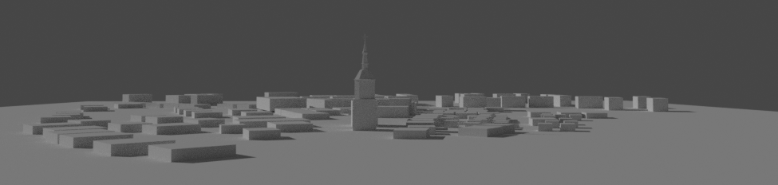
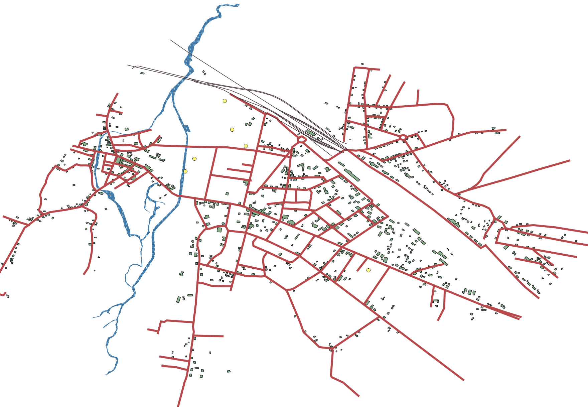
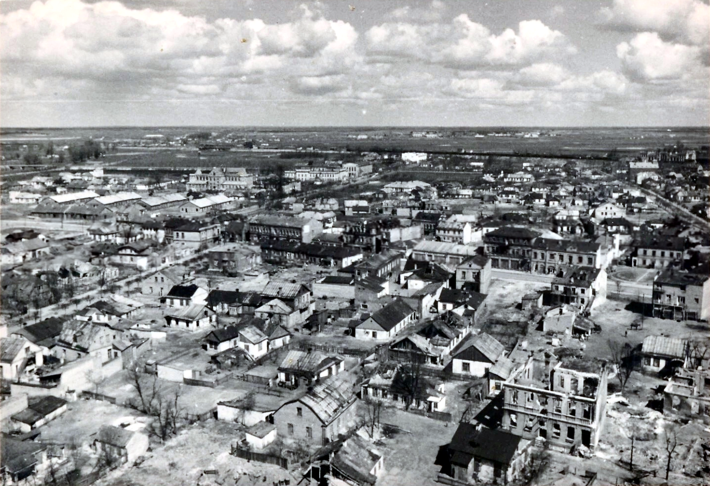
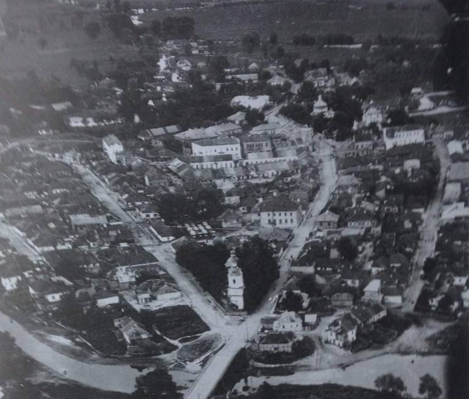
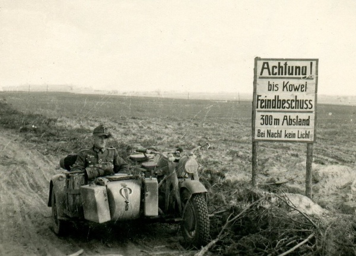

  

# Kowel: A Glimpse into the Past

[Polish Wikipedia: Kowel](https://pl.wikipedia.org/wiki/Kowel) · [English Wikipedia: Kovel](https://en.wikipedia.org/wiki/Kovel) — (1918–1945)

This passion project, developed by [@skilenstein](https://github.com/noveoko), aims to recreate the historic town of Kowel as it existed prior to WWII. If you encounter any errors or have suggestions, please [raise an issue](https://github.com/noveoko/kowel/issues) or submit a pull request.

---

## Table of Contents

- [Gallery](#gallery)
- [Google Earth Map (1919–1939)](#google-earth-map-of-kowel-19191939)
- [Street Names and Businesses](#street-names-and-businesses)
- [Voting Districts and Industries](#voting-districts-and-industries)
- [Data Files](#data-files)
- [Tools and Resources](#tools-and-resources)
- [Related Projects](#related-projects)
- [Datasets](#datasets)
- [Resources for Historical Cartography](#resources-for-historical-cartography)
- [Photos from Kowel and Nearby](#photos-from-kowel-and-nearby)

---

## Gallery

**Kowel "Old Town" circa 1915 / Kowel as it appeared during WWII**

**In-progress map of Kowel**

**1938 Sejm voting districts**

### The Eastern half of Kowel

*East of Kowel, circa 1944.*

### The "Old Town" of Kowel as it appeared in 1915

---

## Google Earth Map of Kowel (1919–1939)

[**Download the Kowel 2RP Google Earth file (.kmz)**](GIS/kowel_streets15.kmz)

This work-in-progress Google Earth file includes:

- Pre-WWII street names
- Over 130 pre-war buildings, identified through manual exterior review and old photos where available

---

## Street Names and Businesses

| Resource | Description |
| --- | --- |
| [Kowel street names (1929)](street_names.txt) | List of 1929 Kowel street names |
| [Cross-referenced street names (1929)](referenced_streets.txt) | Street names cross-referenced across sources |
| [Doctors resident in Kowel (1920)](doctors_resident_in_kowel.csv) | List of doctors · [Source](https://bc.wbp.lublin.pl/dlibra/publication/edition/17315) |
| [Most common business-address streets (~1929)](streets_by_business_address_count.csv) | Top streets by number of business addresses |
| [Kowel phone book / residents (1938)](kowel_residents_1938.csv) | Residents listed in the 1938 phone book |
| [Polish business directory (1929)](1929_business_directory.md) | 360+ business listings |

---

## Voting Districts and Industries

| Resource | Description |
| --- | --- |
| [Kowel voting districts (1938)](kowel_voting_districts.csv) | [Published 28 September 1938](https://polona.pl/item/obwieszczenie-inc-na-podstawie-art-52-ordynacji-wyborczej-dz-u-r-p-nr-47-poz,OTQyNjM5MzI/0/#info:metadata) |
| [Business types in Kowel (1929)](industries_in_kowel_1929.csv) | List of business types (requires manual verification and correction) |

---

## Data Files

A full list of structured data and supporting documents in this repository:

- [1899 travel guide to Kowel](1899_Travel_Guide_to_Kowel_based_on_1899_Polish_doc.md) — based on an 1899 Polish document
- [1929 business directory (CSV)](1929_business_directory.csv) · [1929 business directory (Markdown)](1929_business_directory.md)
- [Analysis of industry by street](analysis_of_industry_by_street.md)
- [City population summary](city_population_summary.md)
- [Doctors resident in Kowel (1920)](doctors_resident_in_kowel.csv)
- [Industries in Kowel (1929)](industries_in_kowel_1929.csv)
- [Kowel residents (1938)](kowel_residents_1938.csv)
- [Kowel voting districts (1938)](kowel_voting_districts.csv)
- [Kowel streets — 1929 phone book (Polish streets)](Kowel%20Streets%201929%20Phone%20Book%20-%20Polish%20Streets.csv)
- [Streets (CSV)](streets.csv) · [Street names](street_names.txt) · [Referenced streets](referenced_streets.txt)
- [Streets by business-address count](streets_by_business_address_count.csv)
- [Building coordinates](building_coordinates.txt)
- [Old buildings dataset (ZIP)](old_buildings_dataset.zip)
- [Point clouds notes](point_clouds.md)
- [Street graph notebook](draw_street_graph.ipynb)

---

## Tools and Resources

- [3D from Images (COLMAP)](https://colmap.github.io/install.html#installation)
- [Shtetl: Kovel, Ukraine (JewishGen)](https://kehilalinks.jewishgen.org/kovel/kovel.htm)
- [Mazowiecka Digital Library](https://mbc.cyfrowemazowsze.pl/dlibra)
- [Polona](https://polona.pl/)
- [Szukaj w Archiwach](https://www.szukajwarchiwach.gov.pl/)
- [Arolsen Archives: People Persecuted by the Nazi Government](https://collections.arolsen-archives.org/en/archive/6)
- [Areas Photographed (US National Archives)](https://catalog.archives.gov/id/44240512)
- [Application of Aerial Photograph Analysis in the Search for Burial Sites (PDF)](https://problemykryminalistyki.pl/pliki/dokumenty/5_ossowskibykowskawitowskabrzezinskiapplicationofanalysis.pdf)
- [Co-registration of Panoramic Mobile Mapping Images and Oblique Aerial Imagery (University of Twente)](https://research.utwente.nl)
- [Personal Knowledge Graphs (YouTube)](https://www.youtube.com/watch?v=Cq8VzELJpwI)

---

## Related Projects

- [Detectron2 tutorial (YouTube)](https://www.youtube.com/watch?v=9a_Z14M-msc)

---

## Datasets

- A black-and-white old-image dataset for training a deep-learning model to power a "similar building" search engine.

---

## Resources for Historical Cartography

A short reading list for historical reconstruction from maps:

1. [Cartographic Reconstruction of Historical Environmental Change](https://www.researchgate.net/publication/277355317_Cartographic_Reconstruction_of_Historical_Environmental_Change) — using historical maps for environmental-history research.
2. [Cartographic Reconstruction of Building Footprints from Historical Maps](https://onlinelibrary.wiley.com/doi/abs/10.1111/tgis.12610) — a study based on the Swiss Siegfried maps.
3. [Rehabilitating "Historical Map" (Mapping as Process)](https://www.mappingasprocess.net/blog/2020/8/13/rehabilitating-historical-map) — on analytical mapping of historical maps.
4. [History of Cartography (Wikipedia)](https://en.wikipedia.org/wiki/History_of_cartography) — extensive links and references.
5. *Mapping the Nation: History and Cartography in Nineteenth-Century America* — book by Susan Schulten.
6. *Maps: A Historical Survey of Their Study and Collecting* — edited by David Woodward.
7. The History of Cartography Project — research project at the University of Wisconsin.
8. [Euratlas Historical Maps](https://www.euratlas.com/) — historical maps from year zero AD onward.
9. [David Rumsey Historical Map Collection](https://www.davidrumsey.com/) — digital map collection under Creative Commons.
10. [Global ML Building Footprints (Microsoft)](https://github.com/microsoft/GlobalMLBuildingFootprints) — global building-footprint map.

---

## Related Project: HistoricEarth

As an offshoot of the Kowel project, [HistoricEarth](https://github.com/noveoko/HistoricEarth) trains a generative model (GAN) to take an old map of Poland from the 1900–1944 period and render a photo-realistic, simulated aerial image.

---

## Photos from Kowel and Nearby

*German (Nazi) soldier in a vehicle. Signage: "to Kovel — enemy fire 300 m distance. Caution! No light at night."*

---

## About

Kowel / Kovel: (1918–1945)
