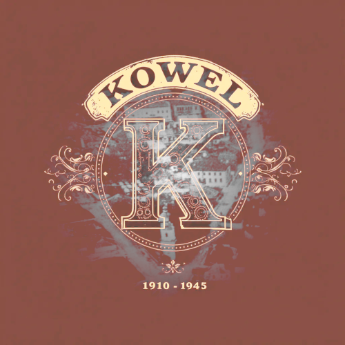
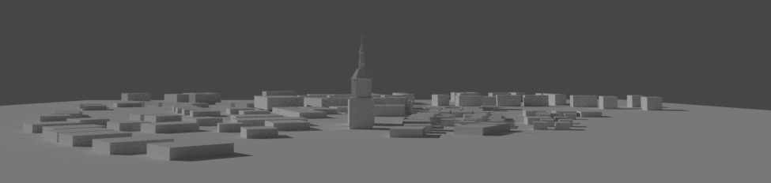
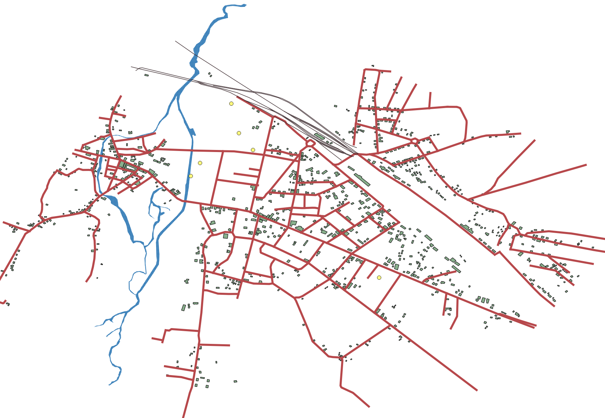
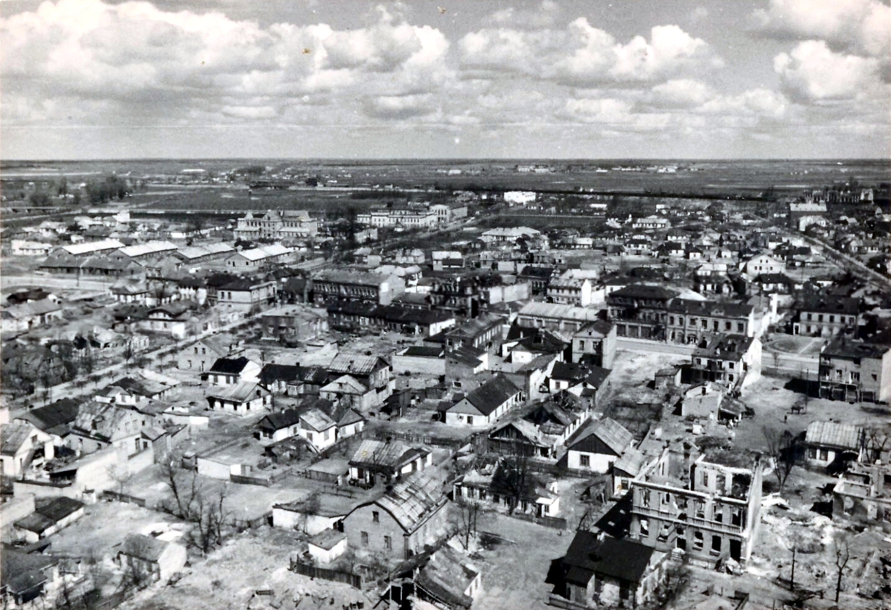

<p align="center">
  <a href="images/logo_small.png"></a>
</p>

# Kowel / Kovel reconstruction (1918–1945)

[Polish Wikipedia](https://pl.wikipedia.org/wiki/Kowel) · [English Wikipedia](https://en.wikipedia.org/wiki/Kovel) · issues: [noveoko/kowel](https://github.com/noveoko/kowel/issues)

A project to reconstruct the town of Kowel (today Kovel, Ukraine) as it stood
before WWII: streets, buildings, firms, and people, pinned to period maps and
primary documents.

Original code is MIT; original tables are [CC BY 4.0](LICENSE-DATA). Third-party
scans and gazette OCR stay under their archives’ terms. See [LICENSE](LICENSE).
Names of victims and wanted persons: [NAMES.md](NAMES.md).
File-by-file inventory: [archives/DATA.md](archives/DATA.md).

---

## Mission

The unit of work is a **building on a 1939 map**. Photos, directories, and
gazettes are evidence for that building. Automated city-scale photogrammetry
is out of reach; the 3D model is assembled by hand, guided by a georeferenced
street map and a closed list of attested street names.

## Map

The geographic spine (schematic gold-standard map, still being digitized):

- [Landmark map gold standard](archives/landmark_map_gold_standard/readme.md) — digitizer, nodes/edges, georeference, snap-to-OSM, KMZ
- [Google Earth 1919–1939 KMZ](GIS/kowel_streets15.kmz) — pre-war street names and ~130 buildings
- [1938 Sejm voting districts](archives/landmark_map_gold_standard/voting_districts_kowel.csv) ([Polona source](https://polona.pl/item/obwieszczenie-inc-na-podstawie-art-52-ordynacji-wyborczej-dz-u-r-p-nr-47-poz,OTQyNjM5MzI/0/#info:metadata)) · [SVG](images/kowel_voting_districts.svg)
- Canonical buildings: [archives/normalized/buildings.csv](archives/normalized/buildings.csv) (`building_id`, optional `map_node_id` / lat/lon)
- Seeds that feed it: [maps/kowel_buildings.csv](maps/kowel_buildings.csv), [maps/kowel_landmarks_index.csv](maps/kowel_landmarks_index.csv), [archives/known_buildings.csv](archives/known_buildings.csv)

## Streets

Canonical list (`street_id`, attestation years, rename/`same_as` corridors, `exists_today`):

- [archives/normalized/kowel_streets_truth_table.csv](archives/normalized/kowel_streets_truth_table.csv) (same rows: [streets.csv](archives/normalized/streets.csv)) · [notes](archives/normalized/kowel_streets_truth_table.md)

Older name dumps (`streets.csv`, `street_names.txt`, the 1929 phone-book street
CSV) fed that table. Prefer the truth table in new work.

Rebuild after editing seeds:

```bash
python archives/build_streets_truth_table.py
python archives/build_canonical_tables.py
```

Read rotated labels on a map scan: [apps/street_name_ocr](apps/street_name_ocr/readme.md)
(ranks EasyOCR output against the truth table).

```bash
cd apps/street_name_ocr
pip install -r requirements.txt
streamlit run app.py
```

## Buildings and evidence

Canonical building rows: [archives/normalized/buildings.csv](archives/normalized/buildings.csv).
A later evidence tool can hang photos on `building_id`. Spec:
[apps/image_matcher/kowel_archive_tool_spec.md](apps/image_matcher/kowel_archive_tool_spec.md).

Until that exists, treat photo tools under `apps/` as experiments. Focus stacking
is the only app with an automated test suite.

## People and firms

| Resource | Role |
| --- | --- |
| [normalized/people.csv](archives/normalized/people.csv) | Canonical people (`person_id`; clustered only on given+surname+birth year) |
| [normalized/people_sources.csv](archives/normalized/people_sources.csv) | One row per source extract line |
| [normalized/firms.csv](archives/normalized/firms.csv) | 1929 directory + Obwieszczenia + 1938 businesses (`firm_id`, `street_id`) |
| [normalized/crime.csv](archives/normalized/crime.csv) | Wanted notices with `crime_id`, optional `person_id`, Polona URL |
| [1929 business directory](1929_business_directory.csv) ([notes](1929_business_directory.md)) | Source extract |
| [1938 phone book](kowel_residents_1938.csv) | Source extract |
| [Doctors, 1920](doctors_resident_in_kowel.csv) | [Source](https://bc.wbp.lublin.pl/dlibra/publication/edition/17315) |

How to cite names and what not to add: [NAMES.md](NAMES.md). Inventory:
[archives/DATA.md](archives/DATA.md).

### Gazette harvest

From `archives/database of kowel crime/` ([folder readme](archives/database%20of%20kowel%20crime/README.md)):

```bash
uv sync
uv run python harvest_gazeta.py --out data/kowel_criminal_database --sleep 0.35
uv run python harvest_obwieszczenia.py --out data/obwieszczenia_publiczne --sleep 0.4
```

## How to run checks

```bash
python -m pre_commit install
python -m pre_commit run --all-files
```

Hooks block secrets (Gitleaks, detect-secrets), huge files, and Python syntax
errors. Config: [.pre-commit-config.yaml](.pre-commit-config.yaml).

## Gallery

[](kowel_1915.png)
[](images/kowel_preview.png)

[](images/in_progress.PNG)

[](images/kowel_voting_districts.svg)

*East of Kowel, circa 1944:*

[](images/kowel_no_watermark.png)

AI exploratory renders (not evidence): [ai_generated/](ai_generated/readme.md).

## External archives

- [Polona](https://polona.pl/)
- [Szukaj w Archiwach](https://www.szukajwarchiwach.gov.pl/)
- [Mazowiecka Digital Library](https://mbc.cyfrowemazowsze.pl/dlibra)
- [JewishGen — Kovel](https://kehilalinks.jewishgen.org/kovel/kovel.htm)
- [Arolsen Archives](https://collections.arolsen-archives.org/en/archive/6)
- [US NARA aerial coverage](https://catalog.archives.gov/id/44240512)
- Related: [HistoricEarth](https://github.com/noveoko/HistoricEarth) (GAN map → simulated aerial)

## Other tools in the tree

Under [apps/](apps/) there are COLMAP/stereo, Blender helpers, image matching
sketches, and [focus stacking](apps/focus_stacking/readme.md). They are optional.
Reconstruction work starts from the map, the street truth table, and the
directory/gazette CSVs.

Cartography reading list and source-hunting notes: [resources/elevation_maps.md](resources/elevation_maps.md),
[challenges/find_these_sources.md](challenges/find_these_sources.md),
[external_resources/digital_libraries_with_kowel_materials.html](external_resources/digital_libraries_with_kowel_materials.html).
