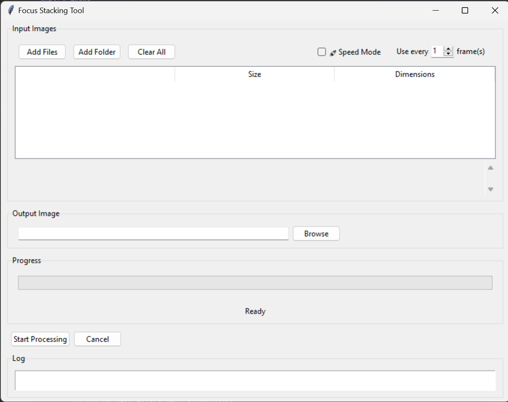

# Focus Stacker

A desktop application for focus stacking photography, built with Python and Tkinter. This tool helps photographers combine multiple images taken at different focus distances to create a single image with greater depth of field.



## Features

- Intuitive GUI interface for image selection and processing
- Support for multiple image formats (JPG, PNG, TIFF)
- Automatic image alignment using Hugin's align_image_stack
- Advanced focus stacking using Enfuse
- Speed optimization mode for faster processing
- Frame skip option for high-fps sequences
- Progress tracking with time estimates
- Preview window for results
- Supports drag-and-drop file selection
- Multi-threaded processing to keep UI responsive

## Prerequisites

- Python 3.10 or higher
- Hugin toolchain (for align_image_stack and enfuse)

### Required Python packages:
```bash
pip install -r requirements.txt
```

## Installation

1. Install Hugin from [their website](http://hugin.sourceforge.net/) or your package manager
2. Clone this repository:
   ```bash
   git clone https://github.com/yourusername/focus-stacking.git
   cd focus-stacking
   ```
3. Install dependencies:
   ```bash
   pip install -e .
   ```

## Usage

Run the application:
```bash
python run.py
```

Basic workflow:
1. Click "Add Files" or "Add Folder" to select your source images
2. Choose an output location
3. (Optional) Enable "Speed Mode" for faster processing
4. (Optional) Adjust frame skip for high-fps sequences
5. Click "Start Processing"

## Development

### Project Structure
```
focus_stacking/
├── src/
│   └── focus_stacking/
│       ├── assets/
│       ├── __init__.py
│       ├── main.py
│       ├── progress_tracker.py
│       ├── preview_window.py
│       └── utils.py
├── tests/
│   ├── __init__.py
│   └── test_photo_stacker.py
├── docs/
├── requirements.txt
├── setup.py
└── README.md
```

### Running Tests
```bash
python -m pytest tests/
```

### Building Distribution
```bash
python setup.py sdist bdist_wheel
```

## Contributing

1. Fork the repository
2. Create your feature branch (`git checkout -b feature/amazing-feature`)
3. Commit your changes (`git commit -m 'Add some amazing feature'`)
4. Push to the branch (`git push origin feature/amazing-feature`)
5. Open a Pull Request

## License

This project is licensed under the MIT License - see the [LICENSE](LICENSE) file for details.

## Acknowledgments

- [Hugin](http://hugin.sourceforge.net/) for align_image_stack and enfuse tools
- Python Tkinter for GUI framework
- PIL/Pillow for image processing

## Troubleshooting

### Common Issues

1. **"Required tools not found"**
   - Make sure Hugin is installed and in your system PATH
   - Verify installation paths in the configuration

2. **"Processing failed"**
   - Check input image formats are supported
   - Ensure enough disk space for temporary files
   - Verify input images are from the same scene

3. **Performance Issues**
   - Enable "Speed Mode" for faster processing
   - Use frame skip for high-fps sequences
   - Reduce image resolution if memory is limited

For more issues, please check our [Issues](https://github.com/yourusername/focus-stacking/issues) page.

## Release History

* 1.0.0
    * Initial release
    * Basic focus stacking functionality
    * GUI interface

## Contact

Your Name - [@yourtwitter](https://twitter.com/yourtwitter)

Project Link: [https://github.com/yourusername/focus-stacking](https://github.com/yourusername/focus-stacking)

