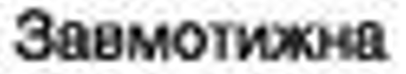

# String Prediction based on Length in Pixels

## Problem Definition



Given a scan of a map and a list of all the street names that may or may not exist in this specific map determine which of the street names a given section of the map most likely contains

## Technology

scikit learn

## Data Collection

For your map, using your softwares measuring tool:
1. Identify a word that is legible and exists in your list of street names
2. Measure the length (in pixels) of the word
3. Measure the length in chars of the word
4. Repeat steps 1-3 until you've collected at least 10-30 examples

## Code

```python
from sklearn.ensemble import RandomForestRegressor

chars = [9,9,5,8,8,10,10,7,12,8]
length = [129.9, 176.1, 89.4,142,132,136,185.2,113.8,224,130]

# Load data
data = pd.DataFrame({'characters_in_word':chars, 'len_in_pixels': length})

# Switch features and target
X = data[['len_in_pixels']]
y = data['characters_in_word']

# Create and fit the model
model = RandomForestRegressor()
model.fit(X, y)

# Make predictions
predictions = model.predict(X)

# Print the results
print("Random Forest Regressor Model")
print("Predictions: ", predictions)

# Predicting for a new pixel width
target = 119 #pixels

new_word = [[target]]
predicted_len = model.predict(new_word)
print(f"Predicted chars in word for pixel width of: {target} for new word with 5 characters: ", predicted_len)
```

# Conclusion

Hopefully this will help you in those difficult cases where you simply cannot determine anything about a string in an image but it's length in pixels. 
