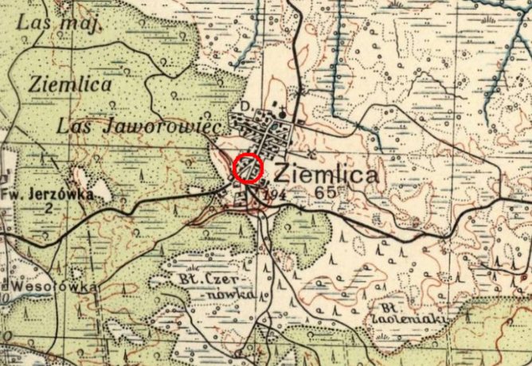

# Ziemlica

**Gmina** Korytnica

**County** Włodzimierski

**Voivodeship** Wołyńskie

**Roman Catholic Parish** Binduga Swiętego Mikołaja

## Extinct village in present-day Ukraine

## Most common surnames among those getting married

* Kuniczuk/Куничук/Кунічук 73
* Stadnicka/Stadnicki/Стадницкий/Стадніцький 37
* Tatys/Папочка/тато 30
* Błaszczuk/Блащук/Блащук 25
* Steczuk/Стечук/Стечук 24

## Most common surnames among those being born

* Kuniczuk/Куничук/Кунічук 148
* Tatysiuk/Tatesiuk/Татесюк 56
* Błaszczuk/Блащук/Блащук 53
* Stadnicka/Stadnicki/Стадницкий/Стадніцький 53
* Dominczuk/Доминчук/Домінчук 43
* Steczuk/Стечук/Стечук 39
* Tatys/Папочка/тато 22
* Jasiński/Ясински/Ясінського 20

## Most common surnames among those dying (prior to 1942)
* Kuniczuk/Куничук/Кунічук/Koniczuk 93
* Tatysiuk/Tatesiuk/Татесюк/Tatesiuk 59
* Błaszczuk/Блащук/Блащук 35
* Stadnicka/Stadnicki/Стадницкий/Стадніцький 15
* Steczuk/Стечук/Стечук 42

## Most common surnames among those killed 1942-1945

 * Tatysiuk/Tatesiuk/Татесюк/Tatesiuk/Tatys
 * Błaszczuk/Блащук/Блащук
 * Zielińska/Zieliński/Зелинска/Зєлінська
 * Jasiński/Ясински/Ясінського
 * Kuniczuk/Куничук/Кунічук
 * Neczaj/Нечай/Нечай
 * Kobylarz/Кобыларз/Кобилярж
 * Stadnicka/Стадницкая/Стадницька
 * Stolarczuk/Столарчук/Столарчук
 
## Sources

[Metryki Wolyn](https://wolyn-metryki.pl/Wolyn/)

[Victims of Ethnic Cleansing in Ukraine 1942-1944](https://zbrodniawolynska.pl/zw1/form/247,Baza-Ofiar-Zbrodni-Wolynskiej.html?szukaj=728340113)
